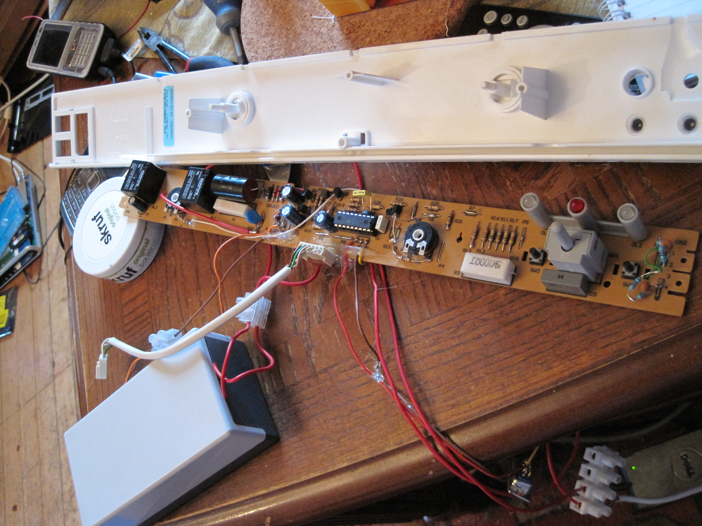

### Kjøleskap (Fridge/Freezer controller) (PIC) (2010)
My fridge died because the capacitor in the C/R power supply failed, killing the PIC MCU on the board. I decided it was worth trying to repair. \
I replaced the powersupply with a safer external, transformer/LM7805 based, and replaced the original MCU (an obsolete PIC chip) first with a pin-compitable 16F628, but ended on 18F1320. \
This is the firmware I wrote for it, trying to replicate the functionality in the old to operate compressor relays, switches, temp sensors and LEDs. \
I also added a RS232 data logger, connected to a webserver and showed the fridge/freezer status (temperatures etc) online, my early take on IoT. I had this running for 9 years, then I bought a new appliance after refurbishing my kitchen.

* PIC18F1320 / C++ (CCS / MPLAB)

