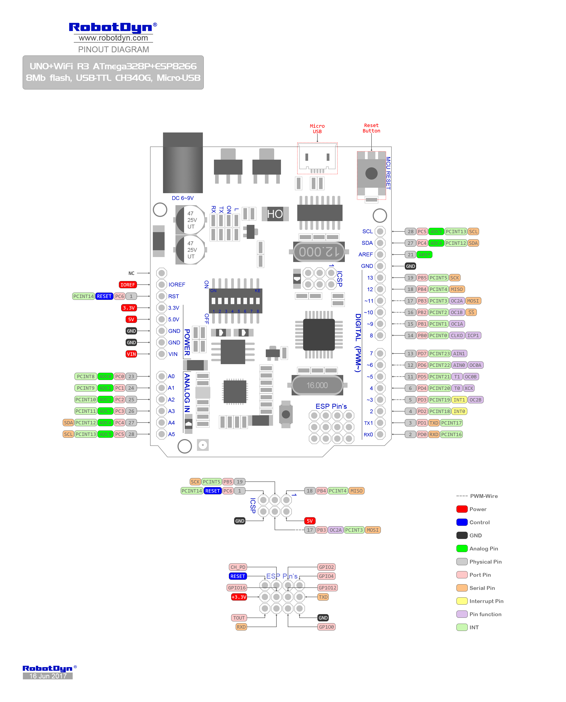

# PumpController

## Description

**This project is a part of my House Automation system, and is the module responsible for the water pump.**

*Started as a Christmas project in 2020*

## Purpose
Currently it is responsible for monitoring the water pressure and temperature in the water pump house, and provide the data in several ways:

- Push to Blynk (IoT APP), see blynk.io
- HTTP (as JSON) (http://board-ip/json)
- Serial (115200)

## Hardware
Robotdyn UNO+WiFi R3 board (Wemos clone), with ATmega328P (Logic/ADC) and ESP8266 (WiFi/networking). The chips are basically separate, and is interconnected via serial port only.\
Data is gathered by ATmega using ADC0/1, then encoded as JSON and sent to ESP (by ATmega SW Serial -> ESP HW Serial for now, I might change to I2C/SPI later).\
When ESP recieves a complete, parsable JSON string, it makes the complete JSON available via HTTP (URL /json) and a simple summary page. It also pushes the values to Blynk server.\
Token used by Blynk login must be defined in main.h (as generated in the app).

## Firmware
Written in C++ using Arduino Core SDK, AVRDude compiler (ATmega), ESP build tools

## Tools

* Visual Code
** PlatformIO extension

## Configuration

I use WiFi Manager library for easy WiFi configuration on the ESP (https://github.com/tzapu/WiFiManager).\
Reset of WiFi settings: press the button on the board while connecting power, hold for 5+ secs and release.\
The board will now become an AP with SSID "KRATECH-AP". Connect to it, open 192.168.1.4 in the browser and configure WiFi settings.

Link to board: https://robotdyn.com/uno-wifi-r3-atmega328p-esp8266-32mb-flash-usb-ttl-ch340g-micro-usb.html

## Future plans
- [ ] Control the water pump
- [ ] Upgrade to use a single ESP32 MCU (replace both)
- [ ] Change interconnection from serial to I2C or SPI

