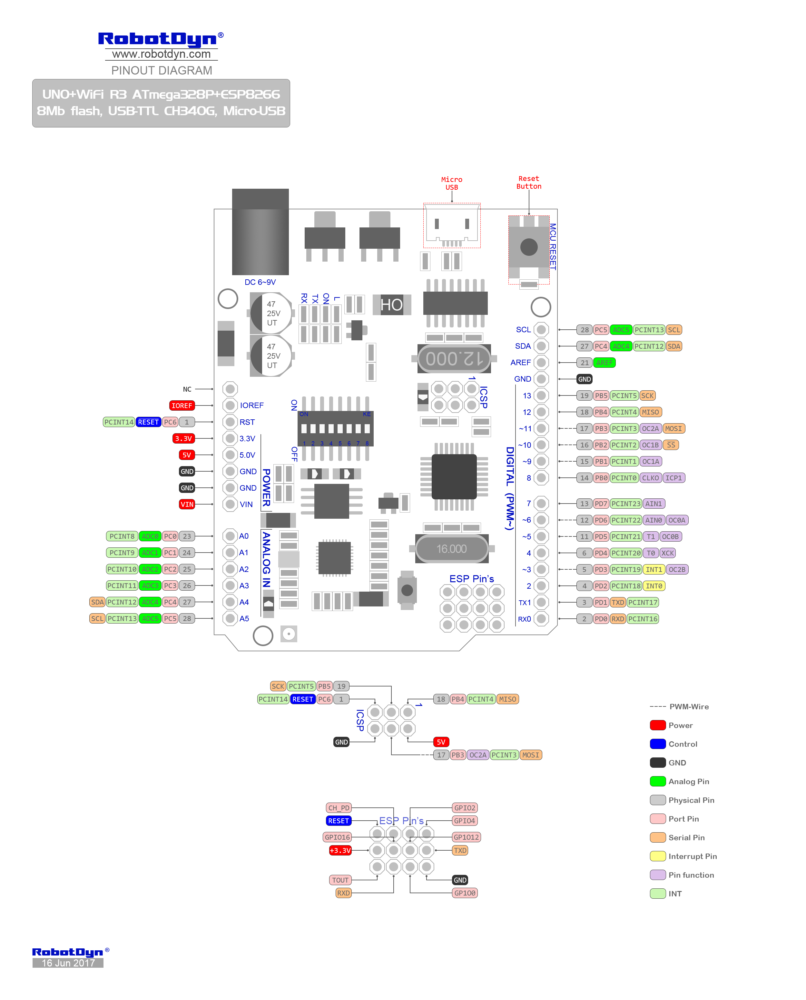

# PumpHouseLogger

**This project is a part of my House Automation system, and is the module responsible for the water pump.**

## Purpose
Currently it is responsible for monitoring the water pressure and temperature in the water pump house, and provide the data in several ways:

- Push to Blynk (IoT APP), see blynk.io
- HTTP (as JSON)
- Serial

## Future plans
- [ ] Control the water pump
- [ ] Change interconnection from serial to I2C or SPI

## Hardware
Robotdyn UNO+WiFi R3 board (Wemos clone), with ATmega328P (Logic/ADC) and ESP8266 (HTTP/WiFi/Blynk). The chips are basically separate, and is interconnected via serial port only.
Data is gathered by ATmega using ADC0/1, then encoded as JSON and sent to ESP. (by ATmega SW Serial -> ESP HW Serial for now, I might change to I2C/SPI later).
When ESP recieves a complete, parsable JSON string, it makes the complete JSON available via HTTP (URL /json) and a simple summary page. It also pushes the values to Blynk server. Token used by Blynk login must be defined in main.h (as generated in the app).

Link to board: https://robotdyn.com/uno-wifi-r3-atmega328p-esp8266-32mb-flash-usb-ttl-ch340g-micro-usb.html

