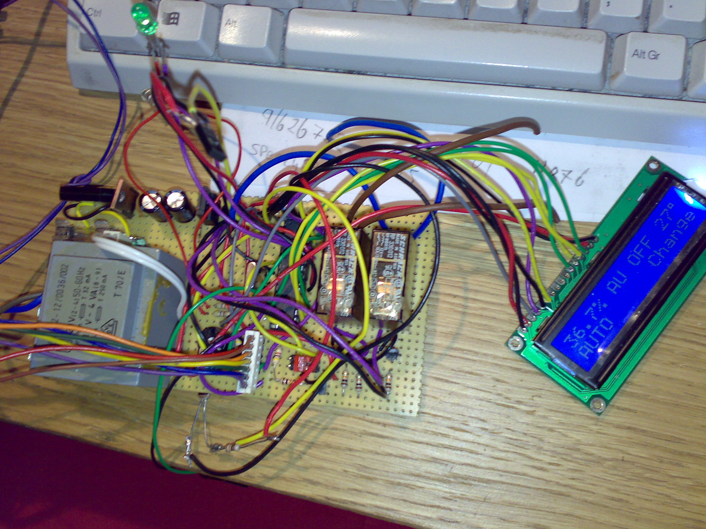
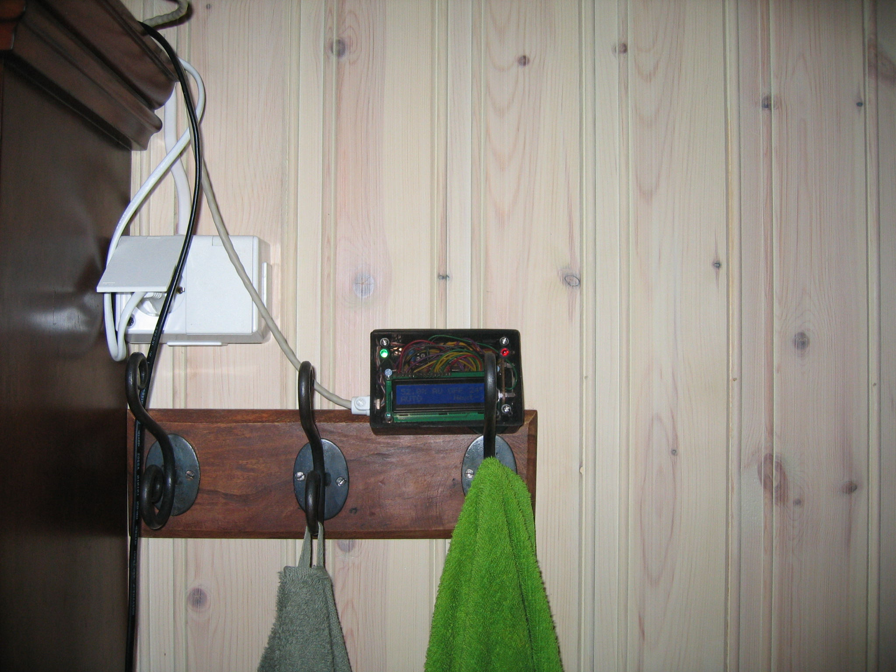

# Badevifte (bathroom fan controller) (2007-2008)

This is (was) a controller for my bathroom exhaust fan. It switched on/off the fan based on humidity and temperature (a standard feature now a days), and displayed temp/hum/mode on a 16x2 LCD. \
It also had a buttons for manual control/mode select. \
This was my first complete, usable PIC based project, I had it going for several years.
I learned a lot from this, really bad code but added for history, original/not touched since 2008 :)

Based on PIC16F876 and C++ (CCS compiler)

